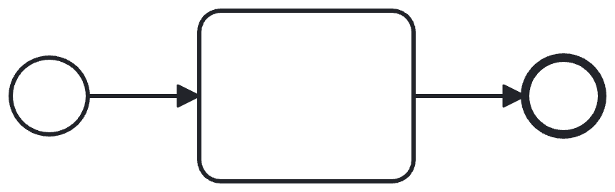
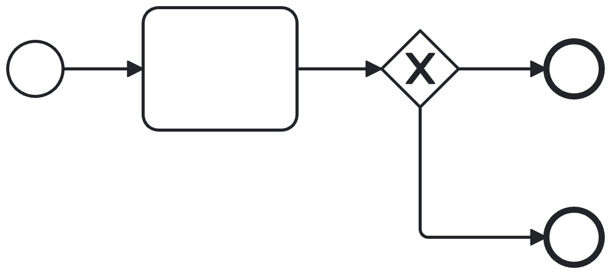
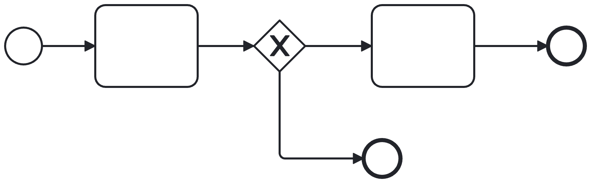
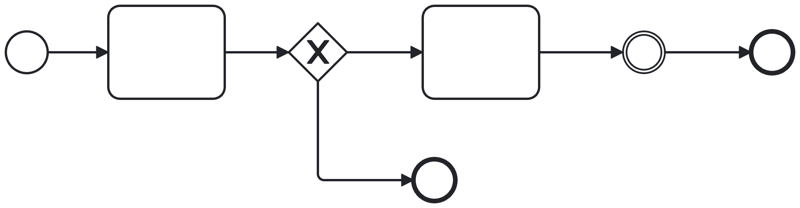

# Todos

-  [ ] Fork von https://github.com/fc-mjoh/camunda-7-schulung-template
-  [ ] https://github.com/fc-mjoh/camunda-wiremock.git ausgecheckt
-  [ ] Wiremock gestartet 


# Aufgabe 1



  * Erstelle einen Service-Task.
  * Rufe den aktuellen Preis ab. (Wiremock: http://localhost:9080/coffee)
  * Hole Preis mittels Camunda Spin aus dem Paylod.
  * Lege ihn in der VariableMap ab.
  * Erstelle vor dem Endpunkt einen User-Task.

https://docs.camunda.org/manual/latest/user-guide/model-api/bpmn-model-api/delegation-code/
https://docs.camunda.org/manual/latest/user-guide/process-engine/variables/
https://docs.camunda.org/manual/latest/reference/spin/


# Aufgabe 2


  * Wandle das Delegate aus Aufgabe 1 in einen External Task um.

https://docs.camunda.org/manual/latest/user-guide/ext-client/spring-boot-starter/
https://github.com/fc-mjoh/camunda-7-externaltask-template
https://github.com/fc-mjoh/camunda-demo/tree/main/camunda-external-task-client


# Aufgabe 3



  * Baue, in der Definition der vorigen Aufgabe, ein Gateway ein. Dieser entscheidet, ob ein Review des Preises erfolgen soll.

https://docs.camunda.org/manual/latest/reference/bpmn20/gateways/


# Aufgabe 4



  * Erweitere die Prozessdefinition um einen User-Task, für den Review und Freigabe der Bestellung.
  * Erstelle eine Form für den User-Task.
  * Enthalten sein muss:
    * Rückgabe Wert: shouldOrder boolean
    * Beliebiges Logo

https://camunda.com/blog/2021/04/camunda-forms-visual-editing-of-user-task-forms/
https://docs.camunda.org/manual/latest/user-guide/task-forms/#camunda-forms


# Aufgabe 5



  * Erweitere die letzte Aufgabe um einen Message Throw-Event (nach dem User-Task)
  * Erstelle eine neue Prozessdefinition (notification-process) mit einem Message-Start Event
  * Message-Start-Event -> User-Task -> End-Event
  * Das Message-Throw-Event soll unser neues Deployment triggern


# Aufgabe 6

  * Sollte der Artikel nicht mehr auf Lager sein („ordered“, „empty“), soll ein Service-Task ausgelöst werden, mit einer Benachrichtigung (einfache Log-Ausgabe)  das ein Mitarbeiter Kaffee kaufen soll.
  * Dahinter soll ein User-Task und ein End-Event angehangen werden.


# Aufgabe 7

  * Input
    * Resturlaub
    * Gewünschte Tage
    * Abwesenheiten im Zeitraum
  * Ouput
    * Genehmigt
  * Regeln
    * Resturlaub >= Gewünschte Tage & Abwesenheiten < 2 = True
    * Resturlaub < Gewünschte Tage = False
    * Abwesenheiten >= 2 = False
  

# Aufgabe 8

  * Starte einen Prozess
  * Schließe den User-Task ab
  * Entferne die fehlerhafte Prozessinstanz

http://localhost:8080/swagger-ui/index.html
https://docs.camunda.org/manual/latest/reference/rest/


# Aufgabe 9

## Ausgangslage: 

| Versicherer | Sparte |
|:---|:---|
|SicherHanse Versicherung|kv, lv|
|NovaSchutz Assekuranz|020, 010|
|VitaGuard Versicherungsgesellschaft|kranken, leben|

Payload über Rest: 

```json
{
  "id": "a",
  "consumer": "b",
  "payload": "{\"sparte\": \"abc\", \"payload\": \"{}\" }"
   }
```

**Systeme:**

| System | Bemerkung |
|:---|:---|
|/kv|Annahme KV, synchron, 201 202 |
|/lv|Annahme LV, asynchron, 200 - Process ID muss mitgesendet werden|
|/dok|Dokumentiert unbekannte Payloads, 201|
|/archive|Archiviert den Payload, 201|

## Aufgabe

  * Schritte
    * Request entgegennehmen (http://localhost:8080/application)
    * Prozess starten
    * Daten verfügbar machen im Prozess
    * Vorgang bestimmen
    * Verteilen
        * KV
        * LV
        * Dok
        * Archivieren
    * Sollte der Vorgang nicht erfolgreich verarbeitet werden sollen -> Hellverarbeitung

**Eigene Ideen sind ausdrücklich erwünscht!**
